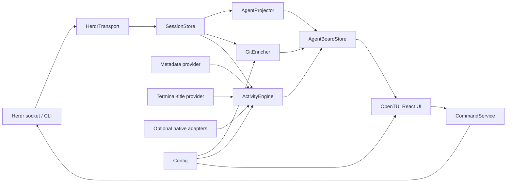

# Herdr Agent Board

## Product Requirements Document (PRD)

**Document status:** Proposed for implementation
**PRD version:** 1.0
**Research snapshot:** 2026-07-18
**Product name:** Herdr Agent Board
**Repository name:** `herdr-agent-board`
**Development plugin ID:** `dev.agent-board`
**Minimum Herdr version:** `0.7.4`
**Initial platforms:** macOS and Linux
**Recommended implementation:** TypeScript, Bun, React, OpenTUI
**Default launch mode:** Session-modal popup
**Secondary launch mode:** Persistent tab
**Network behavior:** Local-only; no network requests by default
**License recommendation:** MIT, subject to the publisher's normal legal review

---

## 1. What this document is

**PRD** stands for **Product Requirements Document**. It describes the problem, intended users, product behavior, scope, requirements, constraints, acceptance criteria, and release plan. It tells implementation agents **what must be true when the product is finished**, while leaving room for engineers to choose low-level implementation details where the choice does not affect product behavior.

This document is deliberately more specific than an idea brief. It is intended to be split into parallel implementation work packages and handed to coding agents.

---

## 2. Executive decision

Build **Herdr Agent Board** as a new, clean-room Herdr plugin.

Do **not** modify Herdr core for the first release. Herdr already exposes the required host capabilities:

- plugin-defined terminal panes;
- session-modal popup panes;
- normal split, tab, overlay, and zoomed panes;
- a one-time session snapshot;
- long-lived lifecycle and agent-status event subscriptions;
- agent, pane, tab, workspace, session, and worktree records;
- semantic agent states;
- native agent-session references when integrations provide them;
- foreground process working-directory reporting;
- terminal-title reporting;
- pane reads and agent focus actions;
- custom pane/workspace metadata.

Do **not** fork the existing `carsonjones/herdr-agent-dashboard` as the default plan. It proves the concept and provides useful prior art, but it is a small polling-based prototype. It currently treats a Claude transcript's latest user prompt as the task, does not provide per-agent Git enrichment, and is not structured as the event-driven, provider-neutral product described here. The repository root inspected during research also did not show a license file; no implementation should copy its code unless the author supplies an explicit compatible license.

The recommended approach is therefore:

1. Use Herdr's socket API as the live data plane.
2. Build an internal normalized agent model that remains stable as Herdr records change.
3. Enrich every agent with Git information resolved from that agent's effective working directory.
4. represent “latest developments” as several **source-labelled signals**, never as a single unqualified guess.
5. Render the data in a fast keyboard-first terminal UI, available both as a popup and a persistent tab.

---

## 3. Product summary

Herdr Agent Board is a local control surface for developers running several coding agents in Herdr.

It answers six questions immediately:

1. **Which agents exist right now?**
2. **Which ones need attention?**
3. **What state is each agent in?**
4. **Where is each agent running?**
5. **Which repository and Git branch is each agent working in?**
6. **What is the freshest trustworthy signal about each agent's work?**

The product should feel like an operational dashboard, not another terminal multiplexer. Its job is to compress a large Herdr session into a reliable, navigable summary.

### One-sentence value proposition

> See every Herdr coding agent, its state, location, Git context, and latest trustworthy activity signal in one live window, then jump directly to the agent that needs you.

---

## 4. Problem statement

Herdr can display and manage many agent panes, but the operator still has to mentally reconstruct the fleet:

- agent state is distributed across panes and sidebar rows;
- a workspace-level branch does not prove which repository or worktree a particular agent is actually operating in;
- an agent may change its foreground working directory after the pane starts;
- a user prompt is not the same thing as current progress;
- terminal output is useful evidence but is noisy, unstructured, and may contain secrets;
- with many agents, blocked and completed agents are easy to miss;
- focusing the right pane requires remembering its workspace, tab, or pane location.

Herdr's configurable sidebar can show compact agent and workspace metadata, but it is not a detailed per-agent dashboard. It does not provide a unified detail view, provenance-aware activity signals, per-agent Git resolution, search, attention ordering, or historical transitions.

### User pain

The operator spends time scanning panes instead of reviewing work. They can answer “what is happening?” only by manually opening agents one by one.

### Product opportunity

Herdr now exposes enough structured state to build a dashboard as a plugin. The remaining product work is aggregation, Git enrichment, careful semantics, interaction design, resilience, and packaging.

---

## 5. Research findings and prior art

### 5.1 Herdr capabilities relevant to the product

As of the research snapshot, Herdr `v0.7.4` is the current stable release. That release added session-modal popup plugin panes and expanded configurable Agent/Space metadata rows. Herdr plugins are executable packages rather than native UI extensions; they can use any runtime and call Herdr through its CLI or raw socket API.

The socket API provides `session.snapshot` for bootstrap state and `events.subscribe` for live updates. Snapshot records include focused IDs, workspaces, tabs, panes, layouts, and agents. Agent and pane records can expose:

- `agent_status`;
- `agent_session`;
- `cwd`;
- `foreground_cwd`;
- `terminal_title`;
- `terminal_title_stripped`;
- stable terminal identity and current pane identity;
- metadata tokens and presentation fields.

Relevant event families include workspace, tab, pane, agent-state, and worktree lifecycle events.

### 5.2 Existing exact-match dashboard

The existing `carsonjones/herdr-agent-dashboard` demonstrates:

- a Bun/TypeScript/OpenTUI React dashboard;
- a table of Herdr agents;
- keyboard selection;
- Enter-to-focus behavior;
- a Herdr plugin action and keybinding;
- a roughly two-second polling loop;
- a Claude-specific lookup of the latest human prompt from local transcript files.

It is useful validation, but not sufficient as the target product because:

- it polls the full list rather than maintaining an event-driven cache;
- its “task” is the latest user prompt, which can be stale or unrelated to present progress;
- it is coupled to Claude transcript storage;
- it does not calculate repository root, branch, detached state, dirty state, ahead/behind, or changed-file counts;
- it has no source-labelled activity model;
- it lacks a detailed selected-agent view and robust reconnect behavior;
- the inspected root did not include an explicit license file.

### 5.3 Adjacent plugins

Adjacent projects validate individual aspects of the concept:

- `herdr-insight` provides an agent-state timeline, multi-workspace tracking, and retention.
- `herdr-telemetry-bridge` derives local workspace, repository, agent, model, and trace-summary telemetry for external clients.
- `herdr-reviewr` focuses on reviewing diffs from agent work.
- `herdr-remote` provides remote timelines, approvals, digesting, and terminal interaction.

None of these is the same product as an in-Herdr, provider-neutral, per-agent operational board with Git and provenance-aware activity summaries.

### 5.4 Build-versus-reuse options

| Approach | Benefits | Problems | Decision |
|---|---|---|---|
| Configure only Herdr's built-in sidebar | No plugin; almost no maintenance | Too compact; workspace-level Git; no detail panel, search, activity provenance, or per-agent Git resolution | Reject for this product |
| Extend the existing dashboard | Fastest visible prototype; matching stack | License ambiguity; polling architecture; Claude-specific semantics; substantial rewrite still required | Use as prior art only unless licensing and architecture are resolved |
| New event-driven plugin | Correct semantics; provider-neutral; clean ownership; scalable architecture | More initial engineering | **Recommended** |
| Add a native Herdr core screen | Deepest integration | Larger contribution burden; slower release coupling; unnecessary for v1 | Reconsider only after plugin limits are proven |

---

## 6. Goals

### 6.1 Primary goals

1. Present one accurate row for every active Herdr agent.
2. Surface blocked and completed agents before agents that do not need attention.
3. Show each agent's effective working directory, repository, and current Git branch.
4. Show the freshest available activity signal with its origin and semantic meaning.
5. Update live without polling every agent on a fixed two-second loop.
6. Let the operator focus the correct agent with one action.
7. Degrade cleanly when Git, metadata, transcripts, or terminal content are unavailable.
8. Keep all data local and avoid persisting raw terminal or transcript text by default.
9. Remain useful with twenty to fifty concurrent agents.
10. Be simple enough for independent coding agents to implement in parallel behind stable interfaces.

### 6.2 Success definition

The product is successful when a developer can open it, identify every agent requiring attention, understand each agent's execution and Git context, and focus the selected agent without manually visiting unrelated panes.

### 6.3 Suggested product metrics

These are local product metrics, not telemetry requirements:

- time from opening the board to first usable agent list;
- time from Herdr state event to visible UI update;
- percentage of agents with resolved effective working directories;
- percentage of agents with resolved repositories and branches;
- percentage of activity signals carrying explicit source labels;
- focus-action success rate;
- stale-cache and reconnect recovery rate;
- average CPU and memory use at 20 and 50 simulated agents.

No external analytics service is required. Benchmarks can be collected in tests and local debug logs.

---

## 7. Non-goals

The first release will not:

- replace Herdr's terminal, layout, or session management;
- provide a graphical desktop or browser UI;
- infer a narrative project status with an LLM;
- claim that terminal text or the latest user prompt is the agent's current task;
- aggregate separate Herdr server sessions or remote machines;
- implement a full Git diff reviewer;
- provide pull-request, CI, issue-tracker, or cloud-provider integrations;
- track token costs across every agent provider;
- continuously ingest and store raw terminal output;
- send, interrupt, kill, restart, or approve agents without an explicit later feature and confirmation flow;
- guarantee support for undocumented provider transcript formats;
- add required changes to Herdr core.

---

## 8. Users and jobs to be done

### 8.1 Primary user

A developer running multiple autonomous or semi-autonomous coding agents in one Herdr session, often across several repositories, branches, or worktrees.

### 8.2 Secondary user

A technical lead supervising several agent-driven implementation workstreams on one workstation.

### 8.3 Jobs to be done

- “When I have many coding agents running, show me which ones need my intervention so I do not scan every pane.”
- “When an agent is working, show me where it is running and what branch it can affect.”
- “When I see a summary, tell me where it came from so I know how much to trust it.”
- “When an agent finishes or blocks, let me jump to it immediately.”
- “When a provider-specific integration is unavailable, keep the board useful with Herdr and Git data alone.”

---

## 9. Product principles

### 9.1 Evidence over inference

Display structured evidence before guesses. An explicit metadata summary is stronger than a terminal title; a terminal title is stronger than interpreting arbitrary output.

### 9.2 Provenance is part of the data

Every activity text must declare what it represents and where it came from. “Last request,” “reported summary,” “terminal title,” “recent output,” and “repository changes” are different concepts.

### 9.3 Semantic state comes from Herdr

Herdr's agent state is authoritative for `working`, `blocked`, `done`, `idle`, or unknown. Cosmetic metadata may enrich the display but must not silently replace semantic state.

### 9.4 Per-agent context beats workspace assumptions

Resolve Git from the agent's foreground working directory, falling back to pane/workspace `cwd`. Do not assume every agent in a workspace shares a repository or branch.

### 9.5 Event-driven first, periodic verification second

Use snapshots and event subscriptions as the main data path. Use bounded periodic checks only for facts Herdr does not emit, notably changes to Git branch/status.

### 9.6 Safe local defaults

No network, no raw transcript persistence, no shell interpolation, and no destructive commands in the first release.

### 9.7 Fast scanning before deep inspection

The table answers “who needs me?” The detail panel answers “what evidence do I have?”

---

## 10. Core experience

### 10.1 Launch modes

The plugin ships two pane entrypoints:

1. **Popup board — default**
   - session-modal popup;
   - recommended size: `90%` width by `85%` height;
   - does not change the current tiled layout;
   - closes after focusing an agent;
   - ideal for quick fleet triage.

2. **Persistent board tab**
   - opens as a normal Herdr tab pane;
   - remains available while the user works elsewhere;
   - useful as a standing control room;
   - can be moved or resized like other normal Herdr panes.

The popup is not itself a regular Herdr pane and therefore has no pane ID. The implementation must use the plugin invocation context and ordinary agent/pane APIs to focus targets.

### 10.2 Default screen

```text
┌ Herdr Agent Board ─ 8 agents · 2 need attention · LIVE ───────────────────────┐
│ / search     filter: all     sort: attention     git: fresh                  │
├───┬─────────┬──────────────┬────────────────────────┬─────────────────────────┤
│   │ STATE   │ AGENT        │ CURRENT SIGNAL         │ REPOSITORY / BRANCH     │
├───┼─────────┼──────────────┼────────────────────────┼─────────────────────────┤
│ ! │ BLOCKED │ Claude · p3  │ Approval requested     │ api · feat/auth-flow     │
│ ✓ │ DONE    │ Codex · p7   │ Tests completed        │ web · fix/navbar         │
│ ? │ UNKNOWN │ Pi · p2      │ Title unavailable      │ tooling · main           │
│ ● │ WORKING │ Claude · p5  │ Refactoring cache      │ api · feat/cache         │
│ ○ │ IDLE    │ Codex · p1   │ Last request: docs     │ docs · docs/agent-board  │
├─────────────────────────────┬─────────────────────────────────────────────────┤
│ SELECTED                    │ ACTIVITY & GIT                                  │
│ cwd  ~/src/api              │ Reported summary · 12s ago                      │
│ tab  auth / pane w2:p3      │ “Approval requested for migration command”      │
│ session herdr:claude …      │ 4 files changed · +132 / -28 · dirty            │
│ state blocked · 1m 42s      │ Recent states: working → blocked                │
└ Enter focus · / search · f filter · s sort · d details · r refresh · q close ┘
```

The exact visual styling may evolve, but the information hierarchy is required:

1. global health and freshness;
2. attention-ranked agent list;
3. source-labelled current signal;
4. repository/branch context;
5. selected-agent detail;
6. keyboard help.

### 10.3 Responsive modes

- **Compact:** under 90 terminal columns. Show state, shortened agent name, compact location, branch, and truncated signal. Detail opens as a separate screen.
- **Standard:** 90–139 columns. Show main table plus selected detail below or beside it.
- **Wide:** 140+ columns. Show table and full side detail simultaneously.

The UI must use text labels as well as icons. Color cannot be the only indicator of state.

### 10.4 Navigation and keys

Required keys:

| Key | Behavior |
|---|---|
| `↑` / `k` | Select previous agent |
| `↓` / `j` | Select next agent |
| `Enter` | Focus selected agent; close popup after successful focus |
| `/` | Open search input |
| `Esc` | Clear search/filter/detail layer; close popup when already at root |
| `f` | Cycle or open state filter |
| `s` | Cycle or open sort mode |
| `d` | Toggle detail view |
| `r` | Refresh snapshot and Git data |
| `g` | Refresh selected agent's Git data |
| `o` | Read selected agent's recent terminal output on demand |
| `q` / `Ctrl+C` | Close the board |
| `?` | Show key help and signal semantics |

Mouse support is optional for the first release.

---

## 11. Information model and semantics

### 11.1 Agent state

Canonical states:

```ts
type AgentState = "blocked" | "done" | "working" | "idle" | "unknown";
```

Unknown or future Herdr states are normalized to `unknown` while preserving the original value for diagnostics.

Default attention order:

1. `blocked` — longest blocked first;
2. `done` — oldest unreviewed first;
3. `unknown` or stale — longest uncertain first;
4. `working` — most recently active first;
5. `idle` — most recently active first.

A row is “unreviewed” only in the board process. Selecting or focusing a completed row marks it reviewed until its state changes again. This is a display convenience, not a replacement for Herdr state.

### 11.2 Agent identity

The UI needs an identity that survives pane movement.

Preferred identity order:

1. Herdr `terminal_id`;
2. native `agent_session.source + agent_session.value` when available;
3. current `pane_id` as a temporary fallback.

The store must update current pane, tab, and workspace IDs after move events. It must not use public `pane_id` as the only durable key.

### 11.3 Working directory

```ts
const effectiveCwd = foregroundCwd ?? cwd;
```

- `foreground_cwd` is preferred because it describes the process currently controlling the pane PTY.
- `cwd` is the pane/workspace directory and remains the fallback.
- The UI displays the effective directory and identifies the fallback only in diagnostics.
- Invalid, missing, inaccessible, or deleted directories do not remove the agent row.

### 11.4 Git context

For each distinct effective working directory, resolve:

- whether it belongs to a Git repository;
- repository root;
- repository display name;
- worktree path;
- current branch;
- detached-HEAD short SHA when applicable;
- dirty/clean state;
- staged, modified, deleted, renamed, conflicted, and untracked counts;
- total changed-file count;
- upstream name when available;
- ahead/behind counts when available;
- last refresh time;
- error or timeout state.

The table shows repository and branch. The detail view shows the rest.

### 11.5 “Latest developments” model

The phrase “latest developments” is ambiguous and dangerous if treated as one field. The product must split it into evidence categories.

#### Current signal

Best available indication of what the agent is currently reporting or presenting.

Priority:

1. explicit pane metadata token such as `summary`, `task`, or configured equivalent;
2. explicit semantic-state message reported through an integration, when exposed;
3. `terminal_title_stripped`;
4. provider adapter's explicit in-progress status, when the adapter can prove its meaning;
5. no signal.

#### Last request

The latest known human request from a provider-native session adapter. It is displayed as **Last request**, never as **Current task**, unless the provider exposes that exact semantic contract.

#### Repository changes

A deterministic Git summary, such as “4 changed files · +132 / -28,” displayed independently from narrative activity.

#### Recent terminal output

An on-demand raw evidence view. It is labelled **Recent terminal output**, stripped of control codes, truncated, and never automatically promoted to “current progress.”

### 11.6 Activity signal type

```ts
type ActivitySource =
  | "reported_metadata"
  | "reported_state_message"
  | "terminal_title"
  | "native_session"
  | "terminal_output"
  | "none";

type ActivitySemantics =
  | "current_signal"
  | "last_request"
  | "raw_output"
  | "repository_change";

type ActivityConfidence = "explicit" | "derived" | "raw" | "unknown";

interface ActivitySignal {
  text: string;
  source: ActivitySource;
  semantics: ActivitySemantics;
  confidence: ActivityConfidence;
  observedAt?: number;
  sourceLabel: string;
  stale: boolean;
}
```

The UI must be able to answer: “Why am I seeing this text?”

---

## 12. Functional requirements

Priority meanings:

- **P0:** required for the first usable product release;
- **P1:** next product increment;
- **P2:** later expansion.

### 12.1 Host integration

| ID | Priority | Requirement |
|---|---:|---|
| FR-001 | P0 | The plugin shall install or link through Herdr using a valid `herdr-plugin.toml`. |
| FR-002 | P0 | The plugin shall provide a popup pane entrypoint and an action that opens it. |
| FR-003 | P0 | The plugin shall provide a persistent tab pane entrypoint. |
| FR-004 | P0 | The manifest shall require Herdr `0.7.4` or newer. |
| FR-005 | P0 | Herdr CLI invocations shall use `HERDR_BIN_PATH` when available. |
| FR-006 | P0 | The plugin shall read its configuration and state paths from Herdr-provided environment variables. |
| FR-007 | P0 | The popup shall close through process exit or `popup.close`, without manipulating the tiled layout. |

### 12.2 Data synchronization

| ID | Priority | Requirement |
|---|---:|---|
| FR-010 | P0 | On startup, the board shall obtain a complete `session.snapshot`. |
| FR-011 | P0 | The board shall maintain a local normalized cache of workspaces, tabs, panes, and agents. |
| FR-012 | P0 | The board shall subscribe to relevant workspace, tab, pane, agent-status, and worktree events. |
| FR-013 | P0 | State and location changes shall update the visible row without a manual refresh. |
| FR-014 | P0 | The board shall resnapshot after reconnecting or when its cache may be stale. |
| FR-015 | P0 | During disconnection, the last known data shall remain visible with a prominent stale indicator. |
| FR-016 | P0 | Unknown response fields shall be ignored safely. |
| FR-017 | P0 | A protocol incompatibility shall produce an actionable version warning rather than a crash. |
| FR-018 | P0 | The board shall not poll the full agent list on a fixed two-second interval. |
| FR-019 | P0 | A manual refresh shall resnapshot and invalidate relevant enrichment caches. |

### 12.3 Agent list

| ID | Priority | Requirement |
|---|---:|---|
| FR-020 | P0 | Every agent present in the normalized snapshot shall appear exactly once. |
| FR-021 | P0 | Each row shall show semantic state, agent identity, location, effective directory, repository/branch, activity signal, and freshness where space permits. |
| FR-022 | P0 | The default sort shall prioritize attention states. |
| FR-023 | P0 | The user shall be able to sort by attention, state, workspace, repository, branch, agent, or recent event. |
| FR-024 | P0 | The user shall be able to filter by state. |
| FR-025 | P0 | The user shall be able to search agent, workspace, tab, pane, path, repository, branch, and activity text. |
| FR-026 | P0 | Selection shall remain stable across unrelated event updates. |
| FR-027 | P0 | When the selected agent disappears, selection shall move predictably to the nearest remaining row. |
| FR-028 | P0 | The board shall display a useful empty state when no agents are active. |

### 12.4 Git enrichment

| ID | Priority | Requirement |
|---|---:|---|
| FR-030 | P0 | Git resolution shall use `foreground_cwd` and fall back to `cwd`. |
| FR-031 | P0 | Git commands shall be executed as an argument array, never through interpolated shell strings. |
| FR-032 | P0 | The board shall identify repository root and current branch for every resolvable agent. |
| FR-033 | P0 | Detached HEAD shall be displayed explicitly with a short commit ID. |
| FR-034 | P0 | Non-Git directories shall display a neutral “not a Git repository” state. |
| FR-035 | P0 | Git failure or timeout shall not block rendering or remove the agent. |
| FR-036 | P0 | Git results shall be cached by repository/worktree identity. |
| FR-037 | P0 | Git refreshes shall be debounced and concurrency-limited. |
| FR-038 | P0 | A bounded watchdog shall eventually detect branch/status changes that do not produce a Herdr event. |
| FR-039 | P1 | The detail view shall show changed-file categories and optional diff statistics. |
| FR-040 | P1 | The user shall be able to copy repository root, branch, or working directory. |

### 12.5 Activity and details

| ID | Priority | Requirement |
|---|---:|---|
| FR-050 | P0 | Every activity value shall include source, semantics, and confidence metadata. |
| FR-051 | P0 | The table shall distinguish “current signal” from “last request.” |
| FR-052 | P0 | The latest user prompt shall never be labelled as current progress without a stronger provider contract. |
| FR-053 | P0 | Explicit reported metadata shall outrank terminal-title and provider-derived signals. |
| FR-054 | P0 | Terminal-title control and spinner glyphs shall be normalized safely. |
| FR-055 | P0 | The detail view shall show current signal, source, age, effective path, Herdr location, session identity when present, and Git summary. |
| FR-056 | P0 | Recent terminal output shall be loaded only on demand. |
| FR-057 | P0 | On-demand terminal output shall be control-code stripped, size-bounded, and not persisted. |
| FR-058 | P1 | Provider-native transcript/session adapters shall be opt-in. |
| FR-059 | P1 | Initial adapters may support Claude, Codex, and Pi behind a common interface. |
| FR-060 | P1 | An optional local timeline shall record normalized state transitions without raw transcript text. |

### 12.6 Actions

| ID | Priority | Requirement |
|---|---:|---|
| FR-070 | P0 | Enter shall focus the selected agent using its current Herdr target. |
| FR-071 | P0 | Focus shall still target the correct agent after pane, tab, or workspace movement. |
| FR-072 | P0 | The popup shall close only after Herdr acknowledges a successful focus request. |
| FR-073 | P0 | A failed focus shall leave the board open and display the error. |
| FR-074 | P1 | The board may expose a command palette for safe read-only actions. |
| FR-075 | P2 | Send, interrupt, approve, stop, or restart actions require separate design, explicit confirmation, and audit-friendly display. |

### 12.7 Configuration

| ID | Priority | Requirement |
|---|---:|---|
| FR-080 | P0 | The plugin shall work with no configuration file. |
| FR-081 | P0 | Configuration shall allow default sort, visible columns, path shortening, Git watchdog interval, and terminal-preview limits. |
| FR-082 | P0 | Invalid configuration shall fall back to defaults and identify the invalid key. |
| FR-083 | P1 | Configuration shall allow custom metadata-token names and adapter enablement. |
| FR-084 | P1 | Configuration shall allow state rank customization without changing canonical state semantics. |

---

## 13. Recommended technical architecture

### 13.1 Stack recommendation

Use:

- **Bun** for runtime, package management, tests, and process spawning;
- **TypeScript** with strict mode;
- **React** for composable terminal UI state;
- **OpenTUI React** for rendering;
- no server-side web framework;
- no database in P0;
- local JSON only for optional configuration and lightweight state.

Why this stack:

- it matches the user's existing TypeScript/React/Bun expertise;
- the prior-art dashboard proves OpenTUI React can render this type of board;
- TypeScript makes protocol types and independent work packages easy to share;
- Bun can spawn argv-safe Git and Herdr commands;
- separating the renderer from the data plane leaves open a later Rust port if profiling demonstrates a real need.

### 13.2 Component diagram



### 13.3 Module responsibilities

#### `HerdrTransport`

- connects to the local NDJSON socket where practical;
- issues requests with unique IDs;
- manages a long-lived event subscription;
- validates top-level response shape;
- exposes reconnect state;
- uses `HERDR_BIN_PATH` for portable one-shot CLI fallbacks;
- never exposes socket transport details to UI components.

#### `SessionStore`

- owns raw normalized workspace, tab, pane, layout, and agent records;
- installs a snapshot atomically;
- applies lifecycle events by revision where available;
- discards stale or duplicate updates;
- tracks connection and cache freshness;
- resnapshots on reconnect.

#### `AgentProjector`

- joins agent, pane, tab, and workspace data;
- calculates effective working directory;
- resolves stable identity;
- preserves current target IDs;
- produces provider-neutral `AgentCard` records.

#### `GitEnricher`

- resolves repository/worktree identity;
- parses Git status;
- caches and debounces commands;
- exposes loading, fresh, stale, unavailable, and error states;
- never blocks session rendering.

#### `ActivityEngine`

- runs activity providers in priority order;
- preserves all relevant evidence;
- selects the table's current signal;
- exposes source-labelled details;
- does not use an LLM or network service.

#### `AgentBoardStore`

- combines projected agent data, Git data, activity, local observed timestamps, reviewed state, filters, sort, and selection;
- exposes a renderer-friendly immutable snapshot;
- is independent of React.

#### `CommandService`

- focuses agents;
- refreshes data;
- reads recent output on demand;
- closes popup;
- centralizes user-visible errors.

#### UI components

- render only the store's view model;
- never call Git or the Herdr socket directly;
- remain testable with static fixtures.

---

## 14. Startup, event, and recovery flow

### 14.1 Startup

1. Read Herdr-provided environment and plugin configuration.
2. Check Herdr server and protocol compatibility.
3. Open the event transport.
4. Request `session.snapshot`.
5. Atomically install snapshot records.
6. Subscribe to the relevant event families.
7. Project agent cards immediately.
8. Render the first usable list without waiting for Git.
9. Enrich Git and activity asynchronously.
10. Mark the board `LIVE` after snapshot and event subscription are healthy.

A narrow snapshot/subscription race is possible in any client. The implementation shall use revision fields where supplied and perform a reconciliation snapshot after establishing or re-establishing the subscription when necessary. The exact handshake should be covered by integration tests against a fake protocol server.

### 14.2 Event handling

| Event | Required reaction |
|---|---|
| `pane.agent_status_changed` | Update state, record observed transition time, recalculate attention sort and activity |
| `pane.updated` | Update title, working directory, metadata, and current target; invalidate relevant activity/Git data |
| `pane.agent_detected` | Add or update agent projection |
| `pane.moved` | Update pane/tab/workspace mapping while preserving stable terminal identity |
| `pane.closed` / `pane.exited` | Remove or mark agent unavailable according to latest snapshot/event data |
| `pane.focused` | Update focused marker |
| workspace/tab lifecycle events | Update labels and location hierarchy |
| `workspace.metadata_updated` | Re-evaluate relevant custom activity metadata |
| worktree lifecycle events | Invalidate repository/worktree cache |

### 14.3 Disconnect and reconnect

- Keep last-known data visible.
- Display `STALE — reconnecting` with elapsed disconnect age.
- Disable or guard commands whose targets may no longer exist.
- Retry with capped exponential backoff and jitter.
- After reconnect, check protocol, resnapshot, reconcile selection, and refresh Git.
- Do not silently claim that stale data is live.

---

## 15. Core domain model

```ts
interface AgentCard {
  id: string; // stable board identity, preferably terminal_id
  terminalId?: string;
  paneId?: string;
  tabId?: string;
  workspaceId?: string;

  agent: string;
  displayName: string;
  provider?: string;
  nativeSession?: {
    source: string;
    agent: string;
    kind: string;
    value: string;
  };

  state: AgentState;
  rawState?: string;
  stateSince?: number; // only when actually observed or restored from board state
  lastHostEventAt?: number;
  focused: boolean;
  reviewed: boolean;

  workspaceLabel?: string;
  tabLabel?: string;
  paneLabel?: string;

  cwd?: string;
  foregroundCwd?: string;
  effectiveCwd?: string;

  git: GitContext;
  activity: ActivityBundle;

  connection: "live" | "stale" | "unavailable";
  revision?: number;
}

interface GitContext {
  status: "loading" | "ready" | "not_git" | "stale" | "error";
  repoRoot?: string;
  repoName?: string;
  worktreePath?: string;
  branch?: string;
  detachedHead?: string;
  clean?: boolean;
  changedFiles?: number;
  staged?: number;
  modified?: number;
  deleted?: number;
  renamed?: number;
  conflicted?: number;
  untracked?: number;
  upstream?: string;
  ahead?: number;
  behind?: number;
  insertions?: number;
  deletions?: number;
  refreshedAt?: number;
  errorCode?: string;
}

interface ActivityBundle {
  currentSignal?: ActivitySignal;
  lastRequest?: ActivitySignal;
  recentOutput?: ActivitySignal;
  repositoryChange?: ActivitySignal;
  candidates: ActivitySignal[];
}
```

### State timestamps

Herdr snapshot data should not be assumed to contain an exact state-start timestamp. On first launch, display `—` rather than inventing an age. Record `stateSince` when the board observes a transition. P1 timeline persistence may restore a trustworthy timestamp from prior board state.

---

## 16. Herdr integration contract

### 16.1 Required methods

P0 depends on the following public capabilities:

- `ping` or equivalent status check;
- `session.snapshot`;
- `events.subscribe`;
- `agent.focus`;
- `agent.read` or `pane.read` for on-demand output;
- optional `agent.get`, `pane.get`, or list calls for targeted recovery;
- `popup.close` for explicit popup closure when needed;
- plugin pane open/focus operations through manifest actions or CLI.

### 16.2 Required record fields

Use fields when present and tolerate absence:

- `terminal_id`;
- `pane_id`, `tab_id`, `workspace_id`;
- `agent` and `agent_status`;
- `agent_session`;
- `cwd` and `foreground_cwd`;
- `terminal_title` and `terminal_title_stripped`;
- labels and focus state;
- `revision`;
- presentation metadata and custom tokens.

### 16.3 Protocol compatibility

- Generate or maintain fixtures from `herdr api schema --json`.
- Parse only required fields.
- Ignore unknown fields.
- Reject missing required envelope fields with a structured diagnostic.
- Check server protocol before relying on v0.7.4 behavior.
- Keep the transport adapter narrow enough to update independently of domain/UI code.

### 16.4 CLI versus socket

- Use the raw socket for snapshot and event streaming on macOS/Linux.
- Use `HERDR_BIN_PATH` for portable one-shot actions and as a fallback.
- Keep a transport interface that can use CLI-based snapshots/events on platforms where direct socket support is undesirable.
- Windows support is deferred from the initial release but must not be made impossible by hard-coded Unix paths outside the transport module.

---

## 17. Git enrichment specification

### 17.1 Commands

Execute commands as argv arrays with a bounded timeout:

```text
git -C <effectiveCwd> rev-parse --show-toplevel
git -C <repoRoot> rev-parse --git-dir
git -C <repoRoot> branch --show-current
git -C <repoRoot> rev-parse --short HEAD
git -C <repoRoot> status --porcelain=v2 --branch --untracked-files=normal
```

Optional P1 detail commands:

```text
git -C <repoRoot> diff --numstat
git -C <repoRoot> diff --cached --numstat
git -C <repoRoot> diff --name-status
git -C <repoRoot> diff --cached --name-status
```

### 17.2 Safety and performance

- Do not invoke `sh -c`, `bash -c`, or interpolate paths into a shell command.
- Apply an initial per-command timeout target of 1.5 seconds.
- Limit concurrent Git processes to four by default.
- Deduplicate agents sharing the same repository/worktree state.
- Do not run full diffs for the table view.
- Cache status by repository root plus worktree identity.
- Debounce repeated invalidations.
- Refresh immediately after effective-directory change and on explicit user action.
- Use a configurable watchdog, default 15 seconds, to catch branch/status changes with no Herdr event.
- Back off refresh frequency for repeatedly timing-out repositories.

### 17.3 Parsing requirements

Tests must cover:

- normal local branch;
- detached HEAD;
- no commits yet;
- clean and dirty states;
- staged and unstaged changes;
- untracked files;
- conflicts;
- rename records;
- upstream absent;
- ahead/behind values;
- subdirectory inside a repository;
- linked Git worktrees;
- deleted or inaccessible directory;
- non-Git directory;
- paths containing spaces, Unicode, and leading hyphens.

---

## 18. Activity engine and provider adapters

### 18.1 Provider interface

```ts
interface ActivityProvider {
  id: string;
  priority: number;
  supports(context: ActivityContext): boolean | Promise<boolean>;
  collect(context: ActivityContext): Promise<ActivitySignal[]>;
}
```

Providers must return evidence, not mutate UI state.

### 18.2 P0 providers

1. **Reported metadata provider**
   - reads configured tokens such as `summary`, `task`, `phase`, or `model`;
   - marks activity as explicit;
   - supports token expiry and removal.

2. **Reported state-message provider**
   - uses a semantic agent message only when present in a public record;
   - preserves state/message distinction.

3. **Terminal-title provider**
   - uses `terminal_title_stripped` first;
   - normalizes remaining control characters;
   - marks the signal as derived.

4. **Git activity provider**
   - supplies repository-change evidence separately;
   - never becomes a narrative current signal by itself.

5. **On-demand terminal provider**
   - calls `agent.read` or `pane.read` with `recent-unwrapped`;
   - defaults to 30 lines and an 8 KiB processed limit;
   - marks data as raw;
   - strips ANSI/control sequences;
   - does not persist content.

### 18.3 P1 native adapters

Candidate adapters:

- Claude Code;
- Codex;
- Pi.

Adapter rules:

- opt-in in configuration;
- read only local provider data associated with the explicit `agent_session` reference when possible;
- do not crawl broad home-directory transcript trees when a session reference is unavailable;
- expose semantics such as `last_request`, `latest_assistant_event`, or `last_tool` only when the provider format supports them;
- fail closed on unknown format versions;
- never call provider APIs over the network;
- never persist raw transcript content;
- include adapter/version provenance in diagnostics.

### 18.4 No LLM summarization in P0/P1

The board shall not send terminal or transcript data to an LLM. Deterministic summaries keep the product fast, private, explainable, and free of per-use cost. A future optional summarizer would require a separate privacy and UX design.

---

## 19. Configuration

Default file location is derived from `HERDR_PLUGIN_CONFIG_DIR`. Recommended file: `config.json`.

Example:

```json
{
  "view": {
    "defaultMode": "popup",
    "defaultSort": "attention",
    "visibleColumns": [
      "state",
      "agent",
      "signal",
      "repository",
      "branch",
      "cwd"
    ],
    "compactPathSegments": 3,
    "showDetail": true
  },
  "git": {
    "enabled": true,
    "watchdogMs": 15000,
    "commandTimeoutMs": 1500,
    "maxConcurrency": 4,
    "includeUntracked": true
  },
  "activity": {
    "metadataTokens": ["summary", "task", "phase"],
    "terminalTitle": true,
    "terminalPreviewLines": 30,
    "terminalPreviewMaxBytes": 8192,
    "nativeAdapters": []
  },
  "privacy": {
    "persistTimeline": false,
    "persistTerminalOutput": false,
    "networkAccess": false
  }
}
```

Configuration requirements:

- validate at startup;
- report the exact invalid path and expected type;
- retain safe defaults for invalid optional fields;
- reject any setting that attempts to enable unsupported network behavior;
- support a documented JSON Schema in P1.

---

## 20. Local state

P0 local state may contain only:

- reviewed/unreviewed markers for the current board process;
- last selected stable agent identity;
- user-selected sort/filter for the current process;
- debug logs when enabled.

P1 optional persisted state may contain:

- normalized state transitions;
- timestamps;
- stable non-secret identifiers;
- configuration-independent migration version.

It must not contain:

- raw terminal buffers;
- raw transcript messages;
- environment variables;
- secrets or tokens;
- full command histories unless separately designed and enabled.

---

## 21. Privacy and security requirements

Herdr plugins run as the user's ordinary local account and are not sandboxed. The plugin must therefore be easy to inspect and conservative by default.

### Required controls

1. No network calls in P0 or P1.
2. No telemetry upload.
3. No shell interpolation for paths or user-controlled values.
4. No persistent raw terminal or transcript content.
5. Transcript/session adapters disabled by default.
6. Terminal previews loaded only after explicit user action.
7. Control-sequence stripping before rendering external text.
8. Length limits for every path, title, metadata value, and output preview.
9. Build and runtime commands visible in the manifest.
10. Clear logs that omit terminal/transcript content unless an explicit debug-content flag is enabled.
11. No copied code from repositories without an explicit compatible license.
12. Dependency lockfile committed; dependency updates reviewed.

### Threat cases

- malicious terminal output attempts terminal escape injection;
- path contains shell metacharacters;
- transcript contains credentials;
- metadata value is extremely long;
- Git command hangs on an unusual filesystem;
- stale pane ID causes an action against the wrong agent;
- hostile or malformed socket payload crashes the renderer;
- plugin dependency executes installation scripts.

Each case must have a test or documented mitigation.

---

## 22. Non-functional requirements

All figures below are engineering targets to validate, not claims about current implementation.

### Performance

- First usable agent list: within 750 ms on a local machine for 20 simulated agents, excluding Herdr startup.
- State-event-to-render latency: p95 below 250 ms.
- Initial Git enrichment: complete for 20 agents across ten repositories within 2 seconds under normal local SSD conditions.
- Supported scale: 50 concurrent agents without functional degradation.
- Idle average CPU after enrichment: below 1% on a representative development machine.
- Resident memory target: below 150 MiB at 50 agents.
- No periodic whole-session poll every two seconds.

### Reliability

- A malformed individual record does not crash the whole board.
- Git errors remain scoped to the relevant agent/repository.
- Reconnect restores a live view without process restart.
- Focus targets are re-resolved against current IDs before execution.
- The UI remains usable while enrichment is loading.

### Compatibility

- Herdr `0.7.4+`.
- macOS and Linux in initial release.
- Terminal widths from 60 to 220 columns.
- Unknown future protocol fields ignored.
- Windows transport and packaging remain possible in a later release.

### Accessibility and legibility

- State has icon and text.
- Focus and selection have non-color indicators.
- Truncation is visually indicated.
- Full values are available in detail view.
- Keyboard help is always reachable.

### Maintainability

- Strict TypeScript.
- No React component performs protocol or process I/O.
- Domain modules have explicit interfaces.
- Public module contracts documented.
- Protocol fixtures and Git fixtures committed.
- Test coverage prioritizes reducers, parsers, state transitions, and safety boundaries.

---

## 23. Error and edge-state UX

| Condition | Required display/behavior |
|---|---|
| No active agents | Explain that no Herdr agents are currently detected; show refresh and close keys |
| Herdr server unavailable | Error screen with retry and detected binary/socket context; do not exit immediately |
| Protocol too old | State required Herdr version and current detected version |
| Disconnected after data loaded | Keep data, show stale banner and reconnect status |
| Git not installed | Disable Git enrichment globally and explain once |
| Directory not in Git | Show `not a Git repository`, not an error icon |
| Git timeout | Show stale/error badge for that repo; continue background backoff |
| Agent has no `foreground_cwd` | Use `cwd` without warning in table; show source in diagnostics |
| No activity signal | Show `No reported activity` rather than inventing text |
| Provider adapter fails | Hide adapter result, retain Herdr/Git data, expose diagnostic in help/log |
| Selected agent closes | Move selection and show a brief notification |
| Focus target is stale | Resnapshot once, retry only if stable identity resolves uniquely, otherwise show error |
| Popup host is busy | Report that Herdr has another modal open; do not open duplicate processes |

---

## 24. Acceptance criteria

### Product acceptance

- **AC-001:** The popup opens from a configured plugin action without changing the tiled tab layout.
- **AC-002:** The persistent tab entrypoint opens as a normal Herdr pane.
- **AC-003:** Every agent in a fixture snapshot appears once and only once.
- **AC-004:** A `pane.agent_status_changed` event updates state and attention ordering without manual refresh.
- **AC-005:** The board uses `foreground_cwd` when present and `cwd` otherwise.
- **AC-006:** For an agent in a Git repository, displayed repository root and branch match direct Git commands run in the effective directory.
- **AC-007:** Detached HEAD, no-Git, inaccessible-directory, and Git-timeout fixtures render without crashing.
- **AC-008:** A latest human prompt is displayed as `Last request`, never as `Current task`, unless an explicit provider contract says otherwise.
- **AC-009:** Every displayed activity detail exposes its source label and semantics.
- **AC-010:** Enter focuses the correct agent after a pane-move event and updated pane ID.
- **AC-011:** A failed focus leaves the board open with an actionable error.
- **AC-012:** When the event stream disconnects, the UI shows stale data and recovers through reconnect plus resnapshot.
- **AC-013:** Recent terminal output is not read until the user requests it.
- **AC-014:** Terminal output containing ANSI escape/control sequences renders as safe text.
- **AC-015:** No raw terminal or transcript content is written to disk under default settings.
- **AC-016:** No network connection is attempted during the full automated test suite and manual smoke test.
- **AC-017:** The board remains navigable at 60, 100, 140, and 200 terminal columns.
- **AC-018:** A load fixture with 50 agents can update states, selection, and sort within performance targets.
- **AC-019:** Unknown protocol fields do not break parsing.
- **AC-020:** The plugin installs/links, builds dependencies, opens both entrypoints, and uninstalls cleanly.

### Release gate

All P0 functional requirements and AC-001 through AC-020 must pass. P1 features are not release blockers.

---

## 25. Test strategy

### 25.1 Unit tests

- snapshot normalization;
- event reducer ordering and revision handling;
- stable identity resolution;
- pane-move remapping;
- effective working-directory selection;
- state rank and secondary sorting;
- search tokenization and path matching;
- activity-provider priority;
- activity semantics and source labels;
- title/control-sequence sanitization;
- Git porcelain-v2 parser;
- detached and unborn branch behavior;
- cache invalidation and debounce;
- configuration validation;
- compact path and text truncation.

### 25.2 Integration tests

Build a fake NDJSON Herdr server that can:

- return session snapshots;
- acknowledge subscriptions;
- emit events;
- reorder or duplicate events;
- disconnect and reconnect;
- return unknown fields;
- return structured errors;
- simulate stale IDs and pane moves.

Integration scenarios:

1. snapshot → subscribe → live event;
2. event during startup reconciliation;
3. duplicate event;
4. stale revision;
5. disconnect with visible data;
6. reconnect and changed snapshot;
7. focus after move;
8. focus target disappeared;
9. protocol too old;
10. malformed record isolated from valid records.

### 25.3 Git fixture tests

Use temporary repositories and real Git commands for:

- clean branch;
- dirty branch;
- staged/unstaged combinations;
- untracked files;
- conflict;
- rename;
- detached HEAD;
- unborn branch;
- upstream ahead/behind;
- linked worktree;
- nested directory;
- Unicode/space path;
- timeout wrapper;
- deleted directory.

### 25.4 UI tests

- snapshot tests for compact, standard, and wide layouts;
- selection stability after reorder;
- filter/search interactions;
- empty, loading, stale, and error states;
- detail-screen signal provenance;
- output-preview safety;
- keyboard help;
- no-color readability.

### 25.5 Manual smoke matrix

- Herdr stable `0.7.4`;
- latest compatible stable Herdr at release time;
- macOS and Linux;
- Claude, Codex, Pi, and unknown/custom reported agents;
- one, ten, twenty, and simulated fifty agents;
- agents sharing a repository;
- agents in different worktrees of one repository;
- agent changes foreground directory;
- branch changes while agent stays in the same pane;
- popup and persistent tab modes.

---

## 26. Repository and code organization

```text
herdr-agent-board/
├── herdr-plugin.toml
├── package.json
├── bun.lock
├── tsconfig.json
├── README.md
├── LICENSE
├── docs/
│   ├── architecture.md
│   ├── activity-semantics.md
│   ├── configuration.md
│   └── troubleshooting.md
├── src/
│   ├── main.tsx
│   ├── launcher.ts
│   ├── app/
│   │   ├── bootstrap.ts
│   │   ├── command-service.ts
│   │   └── agent-board-store.ts
│   ├── herdr/
│   │   ├── transport.ts
│   │   ├── ndjson-client.ts
│   │   ├── cli-client.ts
│   │   ├── protocol.ts
│   │   ├── session-store.ts
│   │   └── event-reducer.ts
│   ├── domain/
│   │   ├── agent-card.ts
│   │   ├── agent-projector.ts
│   │   ├── activity.ts
│   │   ├── attention-sort.ts
│   │   └── search.ts
│   ├── git/
│   │   ├── git-service.ts
│   │   ├── porcelain-v2.ts
│   │   ├── git-cache.ts
│   │   └── git-types.ts
│   ├── activity/
│   │   ├── engine.ts
│   │   ├── provider.ts
│   │   ├── metadata-provider.ts
│   │   ├── terminal-title-provider.ts
│   │   ├── terminal-output-provider.ts
│   │   └── adapters/
│   ├── config/
│   │   ├── schema.ts
│   │   └── load-config.ts
│   ├── ui/
│   │   ├── App.tsx
│   │   ├── AgentTable.tsx
│   │   ├── AgentRow.tsx
│   │   ├── DetailPanel.tsx
│   │   ├── SearchBar.tsx
│   │   ├── StatusBar.tsx
│   │   ├── Help.tsx
│   │   └── layout.ts
│   └── safety/
│       ├── sanitize-terminal.ts
│       └── bounded-text.ts
└── tests/
    ├── fixtures/
    │   ├── herdr/
    │   └── git/
    ├── unit/
    ├── integration/
    └── ui/
```

No file should become the implicit owner of protocol, Git, activity, and rendering behavior at once.

---

## 27. Plugin manifest design

Illustrative manifest; implementation agents must verify exact command names against the target Herdr schema before merging.

```toml
id = "dev.agent-board"
name = "Herdr Agent Board"
version = "0.1.0"
min_herdr_version = "0.7.4"
description = "Live agent state, activity, location, and Git context in one board"
platforms = ["linux", "macos"]

[[build]]
command = ["bun", "install"]

[[actions]]
id = "open"
title = "Open Agent Board"
command = ["bun", "run", "scripts/open-board-pane.ts", "popup"]

[[actions]]
id = "open-tab"
title = "Open Agent Board in Tab"
command = ["bun", "run", "scripts/open-board-pane.ts", "tab"]

[[panes]]
id = "board-popup"
title = "Agent Board"
placement = "popup"
width = "90%"
height = "85%"
command = ["bun", "run", "src/main.tsx", "--mode", "popup"]

[[panes]]
id = "board-tab"
title = "Agent Board"
placement = "tab"
command = ["bun", "run", "src/main.tsx", "--mode", "tab"]
```

Suggested user binding during development:

```toml
[[keys.command]]
key = "prefix+a"
type = "plugin_action"
command = "dev.agent-board.open"
description = "open agent board"
```

The publisher should replace the development plugin ID with an owner-qualified public ID before marketplace release.

---

## 28. Delivery sequence

No calendar-duration estimate is encoded here. Milestones are ordered by dependency and demonstrable value.

### Milestone 0 — Contracts and fixtures

- repository scaffold;
- architecture decision records;
- protocol fixtures from current Herdr schema;
- shared domain types;
- fake Herdr server harness;
- Git fixture helper;
- CI for typecheck, lint, and tests.

**Exit:** Independent agents can implement against stable interfaces without a live Herdr instance.

### Milestone 1 — Live Herdr data plane

- snapshot bootstrap;
- event subscription;
- normalized store;
- reconnect/stale state;
- stable identity and pane-move behavior.

**Exit:** A console fixture shows a correct live normalized agent list.

### Milestone 2 — Git enrichment

- effective-directory resolution;
- repository/branch/status parser;
- caching, timeout, debounce, watchdog;
- Git error states.

**Exit:** Agent cards receive correct Git context across fixture repositories and worktrees.

### Milestone 3 — Core terminal UI

- popup and tab entrypoints;
- table, detail panel, responsive layout;
- selection, search, filter, sort;
- live/stale/error/empty states.

**Exit:** The board can be used for read-only triage.

### Milestone 4 — Activity semantics and focus

- metadata and terminal-title providers;
- source-labelled detail;
- on-demand terminal preview;
- focus action and stale-target recovery.

**Exit:** The product answers all six core questions without provider transcript adapters.

### Milestone 5 — Hardening and distribution

- performance/load tests;
- terminal-output safety;
- documentation;
- marketplace-ready manifest;
- install/link/uninstall smoke tests;
- release checklist.

**Exit:** All P0 acceptance criteria pass.

### Milestone 6 — Optional native adapters and timeline

- opt-in provider adapters;
- normalized transition persistence;
- richer changed-file detail;
- copy and command-palette features.

**Exit:** P1 features remain isolated and do not compromise provider-neutral core behavior.

---

## 29. Parallel work packages

The detailed handoff is also supplied as a companion file. Summary:

### Agent A — Herdr protocol and session store

Owns transport, snapshot, events, revisions, reconnect, schema fixtures, and stable target mapping.

### Agent B — Git enrichment

Owns safe Git process execution, porcelain parsing, repository/worktree cache, watchdog, and fixtures.

### Agent C — Domain and activity semantics

Owns `AgentCard`, projection, state ranking, activity provider contracts, metadata/title providers, and search.

### Agent D — Terminal UI

Owns OpenTUI React rendering, responsive layout, keyboard interaction, details, loading/stale/error states, and UI tests.

### Agent E — Plugin packaging and command service

Owns manifest, popup/tab launcher, focus/read/close commands, environment/config loading, and install smoke tests.

### Agent F — QA and integration harness

Owns fake Herdr server, scenario tests, load tests, security cases, release gate, and documentation verification.

### Merge discipline

1. Merge Milestone 0 contracts first.
2. Agents A, B, and C then work in parallel.
3. Agent D develops against fixture stores rather than waiting for live transport.
4. Agent E develops launcher and commands against interfaces, not UI internals.
5. Agent F continuously adds failing integration scenarios and validates merged work.
6. P1 adapters begin only after P0 activity semantics are accepted.

---

## 30. Risks and mitigations

| Risk | Impact | Mitigation |
|---|---|---|
| “Latest development” is misrepresented | User trusts stale or false progress | Split current signal, last request, raw output, and Git changes; label provenance |
| Herdr protocol evolves | Plugin breaks after upgrade | Narrow transport, schema fixtures, protocol check, unknown-field tolerance |
| Pane ID changes on move | Focuses wrong pane | Prefer stable terminal/session identity; update mapping from events; re-resolve before action |
| Foreground cwd unavailable | Wrong Git context | Fall back to `cwd`; expose source in diagnostics |
| Branch changes without Herdr event | Stale branch | Bounded Git watchdog and manual refresh |
| Large/remote repository makes Git slow | UI stalls or CPU spikes | Async enrichment, timeout, cache, concurrency limit, backoff |
| Provider transcript format changes | Adapter fails or lies | Adapters opt-in, version-aware, fail closed, core independent |
| Terminal/transcript content contains secrets | Leakage to disk or network | No network, no persistence, explicit on-demand preview, truncation |
| Terminal content injects escape sequences | Display manipulation | Strict control-sequence sanitization |
| Prior-art code has unclear license | Legal/release risk | Clean-room implementation; copy nothing without explicit compatible license |
| Popup is not a normal pane | Incorrect assumptions about IDs/events | Treat popup as host surface only; operate on underlying session targets |
| Too many responsibilities converge in UI | Unmaintainable product | Store and service interfaces; UI performs no I/O |
| Polling is accidentally reintroduced | Waste and stale behavior | Performance tests and architectural release gate |

---

## 31. Decisions fixed by this PRD

These defaults should be implemented unless the product owner explicitly changes them:

1. Product working name is **Herdr Agent Board**.
2. Build a new clean-room plugin rather than fork the existing dashboard.
3. Popup is the default; persistent tab also ships.
4. Minimum Herdr version is `0.7.4`.
5. Initial stack is TypeScript + Bun + React + OpenTUI.
6. macOS and Linux are P0; Windows is later.
7. Herdr semantic state is authoritative.
8. Effective cwd is `foreground_cwd ?? cwd`.
9. Git is resolved per agent, not inherited blindly from workspace rows.
10. Snapshot/events are primary; fixed full-list polling is prohibited.
11. Metadata is the strongest narrative activity source.
12. Latest human prompt is labelled `Last request`, not `Current task`.
13. Terminal output is on demand and never persisted by default.
14. Provider-native adapters are P1 and opt-in.
15. No LLM summarization and no network access in P0/P1.
16. Focus is the only agent-affecting action in P0.
17. State timeline persistence is P1 and contains no raw message content.
18. Performance targets are release gates to measure, not reasons for an early Rust rewrite.

---

## 32. Open product questions that do not block P0

These can be tested after the core product exists:

- Whether the public name should become “Herdr Control Room.”
- Whether `done` should sort before `blocked` for some workflows; default remains blocked first.
- Whether reviewed/completed state should persist between board openings.
- Whether the persistent board should support mouse selection.
- Which provider adapter should be implemented first.
- Whether changed-file names belong in P1 detail or should deep-link to a diff-review plugin.
- Whether Windows support should use direct named-pipe transport or CLI-only transport first.
- Whether an optional notification-only daemon should share the same normalized core.

None of these should delay the provider-neutral P0.

---

## 33. Definition of done

The project is done for P0 when:

- all P0 functional requirements are implemented;
- AC-001 through AC-020 pass;
- no unresolved `TODO`, `TBD`, or placeholder behavior remains in production paths;
- protocol, Git, activity, and UI modules have independent tests;
- popup and persistent tab modes pass macOS and Linux smoke tests;
- the board demonstrates live updates without fixed whole-agent polling;
- source labels make activity semantics unambiguous;
- focus works after agent movement and fails safely when the agent disappears;
- default operation performs no network request and persists no raw content;
- dependency and manifest commands are reviewable;
- README explains installation, keybinding, activity semantics, privacy, configuration, and troubleshooting;
- release notes name the exact Herdr versions tested;
- the plugin can be installed, opened, updated, and removed cleanly.

---

## 34. Recommended first implementation slice

The first vertical slice should not attempt the full UI. It should prove the riskiest contracts end to end:

1. Open a minimal popup through the plugin manifest.
2. Connect to Herdr and obtain `session.snapshot`.
3. Subscribe to agent-status and pane-update events.
4. Render one line per agent with state, current pane, and effective cwd.
5. Resolve and display repository/branch asynchronously.
6. Move an agent pane and verify identity/focus still work.
7. Disconnect the event stream and verify stale/reconnect behavior.

Once that slice passes, the remaining UI, activity providers, search, and detail work can proceed with much lower integration risk.

---

## 35. Research source register

Research was performed on 2026-07-18. Implementation agents should re-check public schemas at build time.

### Primary sources

- [Herdr plugins documentation](https://herdr.dev/docs/plugins/)
- [Herdr socket API](https://herdr.dev/docs/socket-api/)
- [Herdr configuration](https://herdr.dev/docs/configuration/)
- [Herdr CLI reference](https://herdr.dev/docs/cli-reference/)
- [Herdr integrations](https://herdr.dev/docs/integrations/)
- [Herdr releases](https://github.com/ogulcancelik/herdr/releases)
- [Herdr repository](https://github.com/ogulcancelik/herdr)

### Prior art and adjacent projects

- [carsonjones/herdr-agent-dashboard](https://github.com/carsonjones/herdr-agent-dashboard)
- [0x5c0f/herdr-insight](https://github.com/0x5c0f/herdr-insight)
- [CodyBontecou/herdr-telemetry-bridge](https://github.com/CodyBontecou/herdr-telemetry-bridge)
- [herdr-reviewr](https://github.com/topics/herdr-plugin)
- [Herdr plugin ecosystem topic](https://github.com/topics/herdr-plugin)

### Technology references

- [OpenTUI](https://github.com/anomalyco/opentui)
- [Bun documentation](https://bun.sh/docs)
- [Atlassian PRD guide](https://www.atlassian.com/agile/product-management/requirements)

---

## Appendix A — Activity wording rules

Allowed:

- `Reported summary: reviewing authentication flow`
- `Terminal title: running tests`
- `Last request: add pagination to user search`
- `Recent output: 30 lines loaded on demand`
- `Repository changes: 4 files changed`
- `No reported activity`

Not allowed without an explicit provider contract:

- `Current task: add pagination` when this is merely the last human prompt;
- `Agent is almost finished` inferred from terminal text;
- `Tests passed` inferred solely from a filename or branch name;
- `Working on authentication` derived from repository name alone;
- unlabelled transcript or terminal excerpts presented as structured status.

---

## Appendix B — Suggested release checklist

- [ ] Protocol fixtures regenerated against target Herdr release
- [ ] Minimum version check verified
- [ ] macOS popup and tab smoke tests pass
- [ ] Linux popup and tab smoke tests pass
- [ ] 50-agent load fixture passes
- [ ] Git worktree and detached-HEAD fixtures pass
- [ ] Disconnect/reconnect suite passes
- [ ] Terminal escape-injection suite passes
- [ ] Network-disabled test passes
- [ ] Default state directory contains no raw output/transcript text
- [ ] Manifest commands reviewed
- [ ] Dependency lockfile reviewed
- [ ] License and notices present
- [ ] Marketplace topic and installation instructions present
- [ ] README documents signal semantics and privacy defaults
- [ ] No production `TODO`/`TBD` markers
